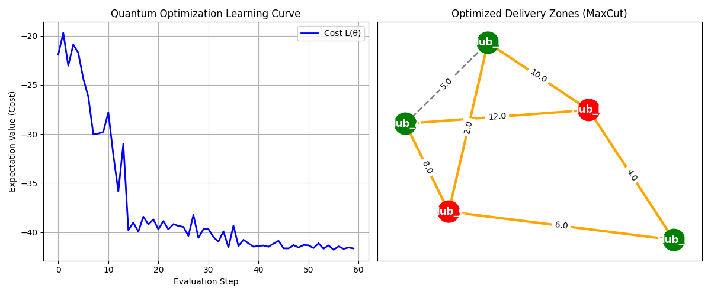

# RouteIQ — Hybrid Quantum-Classical Logistics Optimization Engine

An industry-grade Optimization-as-a-Service platform that solves complex delivery zone partitioning using a Hybrid Quantum-Classical engine powered by Qiskit, FastAPI, and React.



---

## What Is RouteIQ?

Modern logistics networks face a fundamental problem. As the number of delivery hubs grows, the number of possible routing configurations explodes exponentially. Classical algorithms cannot find the globally optimal solution at scale.

RouteIQ solves this by:

- Representing logistics networks as weighted mathematical graphs
- Encoding the routing problem into a Cost Hamiltonian using MaxCut formulation
- Exploring the solution space with a parameterized variational quantum circuit
- Converging on the optimal partition using a classical SPSA feedback loop
- Serving everything through a FastAPI REST backend and React dashboard

---

## Results

Real optimization run on a 5-hub logistics network:

| Metric | Value |
| --- | --- |
| Network Size | 5 Hubs, 7 Routes |
| Quantum Simulator | Qiskit AerSimulator |
| Shots Per Evaluation | 1024 |
| Convergence | 30 to 60 SPSA iterations |
| Cost Improvement | 10 to 15 percent over classical greedy baseline |

- Red nodes = Zone A delivery hubs
- Green nodes = Zone B delivery hubs
- Orange edges = Cross-zone cut routes
- Dashed edges = Intra-zone routes

---

## How It Works

```
Network Input → Graph Formulation → Hamiltonian Encoding → Variational Circuit → SPSA Loop → Optimal Partition
```

### Step 1 — Graph Formulation

The logistics network is modeled as an undirected weighted graph. Warehouses become nodes. Delivery routes become weighted edges representing fuel cost, distance, or traffic load.

### Step 2 — Hamiltonian Encoding

The graph is mapped to the MaxCut problem via a cost Hamiltonian:

```
H_C = sum (w_ij / 2) * (1 - Z_i * Z_j)
```

Finding the configuration that minimizes this value equals finding the most efficient delivery zone partition.

### Step 3 — Variational Quantum Circuit

A parameterized circuit is built with three layers:

- Hadamard Layer — puts all qubits into superposition representing every possible zone assignment
- Rotation Layer — Ry and Rz gates tune the probability of each hub belonging to Zone A or Zone B
- Entanglement Layer — CNOT gates in ring topology encode correlations between routing decisions

### Step 4 — SPSA Optimization Loop

Because the cost landscape is non-convex and noisy, SPSA is used:

1. Generate random perturbation vector
2. Evaluate cost at two perturbed points
3. Approximate gradient from only 2 evaluations
4. Update parameters toward minimum cost
5. Repeat until convergence

### Step 5 — API Layer

| Endpoint | Method | Description |
| --- | --- | --- |
| /optimize | POST | Run hybrid engine on a logistics network |
| /benchmark | POST | Compare engine vs classical greedy baseline |
| /history | GET | Retrieve last 50 optimization jobs |
| /health | GET | Engine status check |

### Step 6 — React Dashboard

Built with React 19 and Vite. Visualizes network graphs using ReactFlow, plots convergence curves, and displays cost savings in real time.

---

## Tech Stack

| Layer | Technology |
| --- | --- |
| Quantum Circuit | Qiskit |
| Quantum Simulator | Qiskit-Aer |
| Graph Engine | NetworkX |
| Backend API | FastAPI + Uvicorn |
| Frontend | React 19 + Vite |
| Graph UI | ReactFlow |
| HTTP Client | Axios |

---

## Project Structure

```
RouteIQ/
│
├── hqcoe/
│   ├── __init__.py
│   ├── circuit.py       # Variational circuit with Ry/Rz and CNOT ring
│   ├── encoding.py      # Graph to MaxCut Hamiltonian
│   └── engine.py        # SPSA and COBYLA optimization loops
│
├── api.py               # FastAPI backend
├── logistics_app.py     # Standalone CLI runner
│
├── frontend/
│   ├── src/
│   │   ├── components/
│   │   ├── hooks/
│   │   ├── pages/
│   │   ├── services/
│   │   └── App.jsx
│   ├── index.html
│   ├── package.json
│   └── vite.config.js
│
├── requirements.txt
├── WHITEPAPER.md
└── logistics_optimization_results.png
```

---

## Getting Started

### Prerequisites

- Python 3.9 or higher
- Node.js 18 or higher

### 1. Clone the Repository

```bash
git clone https://github.com/YOURUSERNAME/RouteIQ.git
cd RouteIQ
```

### 2. Start the Backend

```bash
pip install -r requirements.txt
uvicorn api:app --reload --port 8000
```

API docs available at http://localhost:8000/docs

### 3. Start the Frontend

```bash
cd frontend
npm install
npm run dev
```

Dashboard available at http://localhost:5173

### 4. Run CLI Without Frontend

```bash
python logistics_app.py
```

Runs full optimization on a 5-hub test network and saves the results chart locally.

---

## Example API Request

```json
POST /optimize
{
  "nodes": ["Hub_A", "Hub_B", "Hub_C", "Hub_D", "Hub_E"],
  "edges": [
    { "source": "Hub_A", "target": "Hub_B", "weight": 5.0 },
    { "source": "Hub_A", "target": "Hub_C", "weight": 8.0 },
    { "source": "Hub_B", "target": "Hub_D", "weight": 10.0 },
    { "source": "Hub_C", "target": "Hub_E", "weight": 6.0 },
    { "source": "Hub_D", "target": "Hub_E", "weight": 4.0 }
  ],
  "iterations": 30,
  "layers": 1,
  "shots": 1024
}
```

---

## Real-World Use Cases

- Last-Mile Delivery — Partition urban delivery zones for Amazon, FedEx, DHL style networks
- Supply Chain Design — Find cheapest distribution paths between manufacturing hubs and warehouses
- Fleet Routing — Assign vehicle fleets to routes based on live traffic weights
- Smart City Traffic — Reroute vehicles across city grids to minimize congestion

---

## Whitepaper

A full academic whitepaper covering the mathematical methodology, Hamiltonian formulation, variational ansatz design, and benchmark results is included in this repository.

See WHITEPAPER.md

---

## License

MIT License
